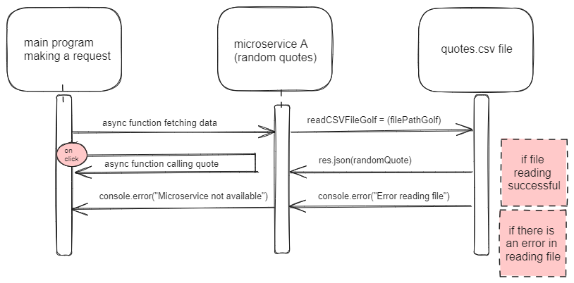

# INSTRUCTIONS TO IMPLEMENT MICROSERVICE A

for Node.js/Express, and assuming these are already installed. if not using Node.js/Express, adapt instructions to language.\

## setting up sender:

1. app reads a CSV with golf quotes. find it [here on Github](https://github.com/6dayspizza/batify_mA/blob/main/files/quotes_golf.csv).
2. randomly selects one
3. packs it into a JSON object and sends into the void through HTTP request. example:\
   `{"id":"8","quote":"I know I am getting better at golf because I am hitting fewer spectators.","author":"Gerald Ford","tags":"golf"}`

## setting up receiver:

1. in _app.js_ of main app, write:\
   `const axios = require('axios');`
2. install new dependency:\
   `npm install axios`
3. set up axios call, in this example, I wanted the data in the header of my main app and wrote this in my _main.js_ file, adapt to yours:

   ```
   async function fetchData() {
       try {
           const response = await axios.get(
               'https://arcane-hollows-29475-7828051692ff.herokuapp.com/random-quote-golf'
           );
           return response.data;
       } catch (error) {
           console.error('Error fetching data from microservice:', error);
       }
   }

   async function showQuote() {
       const data = await fetchData();
       const { quote, author } = data;

       const quoteAuthor = document.getElementById('quoteAuthor');
       quoteAuthor.innerHTML = `<p>"${quote}"</p><p> (${author})</p>`;
       quoteAuthor.classList.toggle('show');
   }
   ```

4. the above call the JSON object. on the header.hbs page, I then called the _showQuote()_-function:\
    `<button id="popupTrigger" class="popup" onclick="showQuote()">`\
   \
   and that was it!


